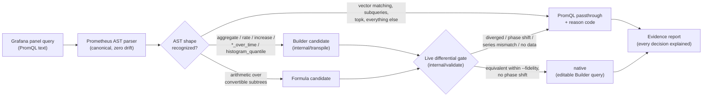
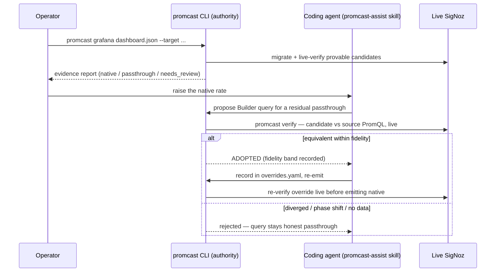

# How the transpiler works: PromQL → SigNoz Builder queries

`promcast` does not string-rewrite PromQL. It parses every expression with the
canonical Prometheus parser (`github.com/prometheus/prometheus/promql/parser` —
the same AST SigNoz itself embeds), walks the typed syntax tree, and emits a
native SigNoz Builder query **only** for shapes whose semantics it can prove on
the live target. Everything else ships as verbatim PromQL passthrough with a
documented [reason code](reason-codes.md) — never a guess, never a drop.

## Stage 1 — Parse, never regex

Every expression goes through the exact parser Prometheus uses in production.
There is no hand-rolled grammar and therefore no parser drift: if Prometheus
can execute it, promcast can classify it. Parse errors are themselves recorded
in the evidence report rather than aborting the run.

## Stage 2 — Structural recognition

The tree walk (`internal/transpile/builder.go`, `histogram.go`, `formula.go`)
recognizes the shapes that have a provable SigNoz Builder equivalent:

| PromQL shape | Builder mapping |
|---|---|
| `metric{label="x", other=~"y.+"}` | `metricName` + filter expression (`=~` → `REGEXP`) |
| `sum/avg/min/max/count by (...)` over a selector | space aggregation + group-by |
| `rate(m[range])`, `increase(m[range])` | time aggregation `rate` / `increase` |
| `agg(*_over_time(m[range]))` | matching time + space aggregation pair |
| `histogram_quantile(φ, sum(rate(m_bucket[Δ])) by (le, ...))` in canonical form | one Builder query with percentile space aggregation |
| Arithmetic over convertible subtrees (`A/B*100`) | Builder formula |

What deliberately stays PromQL passthrough: `on()`/`ignoring()` with
`group_left`/`group_right` vector matching, per-timestamp `topk`/`bottomk`,
subqueries, `predict_linear`, `without()` clauses, and every other construct
whose SigNoz semantics differ. Each carries its reason code in the report —
the boundary is documented, closed, and tested against hostile fixtures.

Deterministic rewrites also happen here: Grafana template variables and global
intervals (`$__rate_interval`, `$__interval`, `$__range`) are substituted, and
metric-name remapping (`remap.go`) handles targets that store dot-normalized
OpenTelemetry names.

## Stage 3 — The live promotion gate

Recognition alone never produces a `native` verdict. Every Builder/formula
candidate is executed against the **live target** and compared with its own
verbatim PromQL passthrough over the same window at the same step
(`internal/validate`). The gate requires series-identity pairing, a minimum
matched-point count, every point within the operator's `--fidelity` tolerance,
and no temporal phase shift (`BUILDER_TEMPORAL_PHASE_SHIFT` rejects candidates
that trail the source by one step even when magnitudes agree). The full
contract lives in [guarantees.md](guarantees.md).

The consequence, stated as the project invariant:

> Nothing is emitted as `native` without passing a live differential against
> its own PromQL passthrough on the target — whether the Builder query came
> from a deterministic rule, a coding agent, or a human operator.

Passthrough is always the floor, so 100% of dashboards migrate and render;
`native` is a verified promotion above that floor, which is what restores
SigNoz-only capabilities such as drilldown and click-to-filter on the panel.

## The most accurate conversion method: promcast + agent

The deterministic engine intentionally stops at what it can prove. The bundled
[Agent Skill](../skills/promcast-assist/) layers a coding agent on top for the
residual — with the CLI, not the agent, holding the authority:

The division of labor is strict:

1. **Deterministic first.** The CLI migrates everything and live-verifies what
   it can prove. This step alone yields a complete, rendering dashboard.
2. **Agent proposes, never decides.** For queries the CLI left as passthrough,
   the agent proposes Builder candidates using the skill's reference material
   (`skills/promcast-assist/references/promql-to-builder.md`).
3. **Every proposal passes the same live gate.** `promcast verify` executes the
   candidate and the source PromQL against the live target and only reports
   `ADOPTED` inside the fidelity tolerance. A hallucinated query cannot pass a
   numeric differential it never satisfies.
4. **Adoption is re-verified.** Adopted overrides go into `overrides.yaml`, and
   the re-emit re-verifies each one live before it is written as `native`.

This layering is why the combination is the most accurate conversion method
available for this migration: the agent adds coverage, the deterministic gate
guarantees that added coverage is exactly as trustworthy as the engine's own —
identical input produces identical, reviewable, live-verified output either
way.

Related reading: [architecture.md](architecture.md) for the package layout,
[guarantees.md](guarantees.md) for the verification contract,
[reason-codes.md](reason-codes.md) for the closed passthrough taxonomy.
